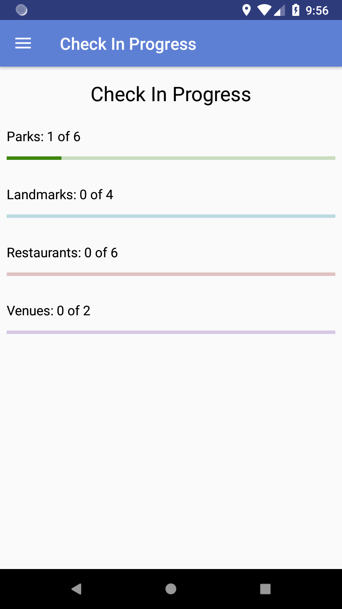
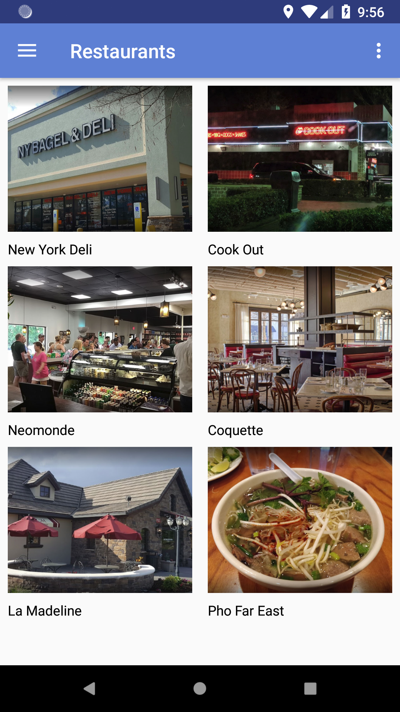

# TourGuideApp
This is my submission for Project 5 of the Udacity Android Basics Nanodegree. It's a tour guide app for the city of Raleigh, NC

<h2>Features</h2>

<b>Navigation Drawer</b> 
Click the hamburger icon in the top left of the screen to open the Navigation Drawer. Select Place Categories or Check In Progress to navigate to those sections of the app.

<b>Location</b> 
This app requires permissions granted for coarse location, fine location, and internet access. The internet access is used to translate addresses to latitude and longitude. The coarse and fine location are used to determine whether you\'re in range to check in to a place. If you\'re testing this app on an emulator, you\'ll need to go to Extended Controls > Location > Send before the virtual device will report its location. Also note that the Android Emulator\'s Extended Controls page lists Longitude, Latitude instead of the standard order of Latitude, Longitude.

<b>Place Check-Ins</b> 
You can check into places when you visit them. Go to a place\'s detail page and click Address to locate it. Once you\'ve traveled to the place, click the Check In button. Go to the Check In Progress page to track your progress.

<b>Check-In Progress Page</b> 
The check-in progress page helps you track your progress visiting the places listed in this app. You can click the place categories on the check-in progress page. When accessing place lists this way, additional icons will be shown to help you identify which places have or have not been visited yet.

<h2>Screenshots</h2>
<table>
  <tr>
    <td></td>
    <td></td>
  </tr>
</table>
  
<h2>Density Variations Application</h2>

As part of this project I also created a Windows console application which automatically creates pixel density variations of your Drawable resources.

Github Repo: https://github.com/jparmstr/AndroidDensities.
